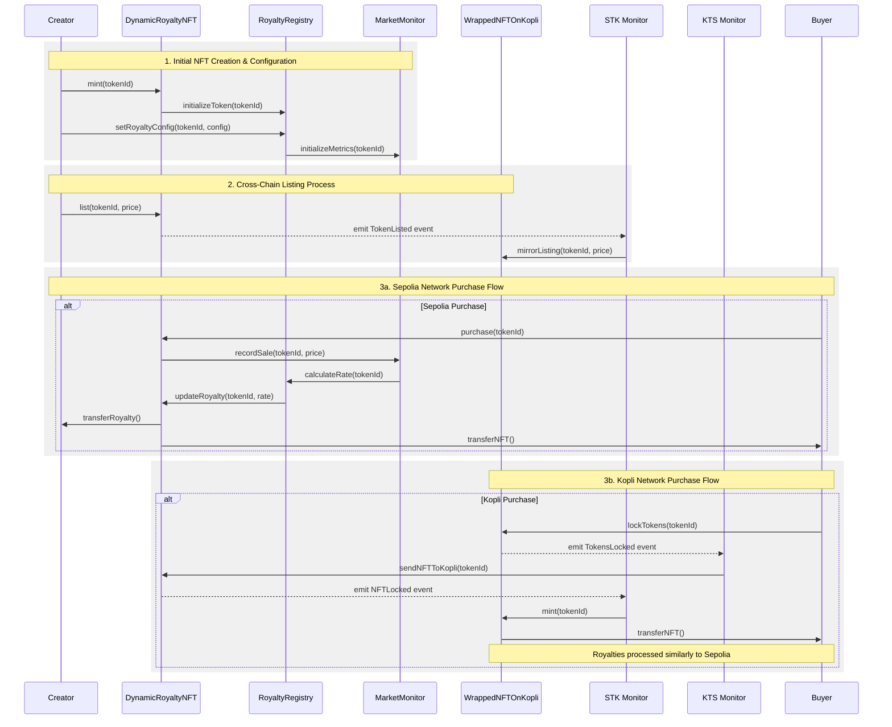

# Dynamic NFT Royalty System Using Reactive Smart Contracts

## Overview

The **Dynamic NFT Royalty System** implements an innovative cross-chain royalty enforcement mechanism using Reactive Smart Contracts (RSCs). This system addresses the critical challenge of NFT royalty evasion while providing dynamic rate adjustment based on market conditions across Sepolia and Kopli networks.

Key features:
- Autonomous cross-chain royalty enforcement
- Market-driven dynamic rate adjustment
- Real-time sales tracking and distribution
- Transparent creator earnings management

## Contracts

### Core Contracts

1. **DynamicRoyaltyNFT (Sepolia)**
   - Manages NFT minting and transfers
   - Implements ERC721 and ERC2981 standards
   - Handles dynamic royalty calculations
   - Address: `0x88048DD557Da01563E72B7003505ABF4b6f53844`

2. **RoyaltyRegistry (Sepolia)**
   - Stores creator royalty configurations
   - Calculates rates based on market data
   - Manages beneficiary information
   - Address: `0x971fe90E7246A53aeAD002544c5AB827a2b27abC`

3. **MarketMonitor (Sepolia)**
   - Tracks real-time market metrics
   - Provides data for rate adjustments
   - Maintains historical price data
   - Address: `0x6E920a818D8eCF03298d754A634c237Fa9BEbC60`

4. **WrappedNFTOnKopli (Kopli)**
   - Manages cross-chain NFT operations
   - Handles REACT token mechanisms
   - Processes cross-chain purchases
   - Address: `0xe4F0d45c970523a835D06615aCCC50B7778859e0`

### Reactive Components

1. **Sepolia to Kopli (STK) Monitor**
   - Monitors: TokenLocked, TokenListed events
   - Chain IDs: Sepolia (11155111) → Kopli (5318008)

2. **Kopli to Sepolia (KTS) Monitor**
   - Monitors: TokensLocked events
   - Chain IDs: Kopli (5318008) → Sepolia (11155111)

## Architecture



## Deployment & Testing

### Prerequisites

Configure the following environment variables:
- `SEPOLIA_RPC`: https://rpc2.sepolia.org
- `SEPOLIA_PRIVATE_KEY`: Your Sepolia private key
- `KOPLI_RPC`: https://kopli-rpc.rkt.ink
- `KOPLI_PRIVATE_KEY`: Your Kopli private key

### Step 1: Deploy Core Contracts

```bash
# Deploy DynamicRoyaltyNFT
forge create --rpc-url $SEPOLIA_RPC --private-key $SEPOLIA_PRIVATE_KEY src/DynamicRoyaltyNFT.sol:DynamicRoyaltyNFT --constructor-args 0x0000000000000000000000000000000000000000 --value 0.1 ether

# Deploy RoyaltyRegistry
forge create --rpc-url $SEPOLIA_RPC --private-key $SEPOLIA_PRIVATE_KEY src/RoyaltyRegistry.sol:RoyaltyRegistry

# Deploy MarketMonitor
forge create --rpc-url $SEPOLIA_RPC --private-key $SEPOLIA_PRIVATE_KEY src/MarketMonitor.sol:MarketMonitor --constructor-args 0x0000000000000000000000000000000000000000 --value 0.1 ether
```

### Step 2: Deploy Wrapped Contract

```bash
# Deploy REACT
forge create --rpc-url $KOPLI_RPC --private-key $KOPLI_PRIVATE_KEY src/REACT.sol:REACT
# Deploy WrappedNFTOnKopli
forge create --rpc-url $KOPLI_RPC --private-key $KOPLI_PRIVATE_KEY src/WrappedNFTOnKopli.sol:WrappedNFTOnKopli --constructor-args 0x0000000000000000000000000000000000000000 ${REACT_CONTRACT_ADDRESS} --value 0.1 react
```
Update all the contracts addresses in reactive contracts as well before deploying them.

### Step 3: Deploy REACTIVE Contracts
```bash
# Deploy STKReactive
forge create --rpc-url $KOPLI_RPC --private-key $KOPLI_PRIVATE_KEY src/STKReactive.sol:STKReactive
# Deploy KTSReactive
forge create --rpc-url $KOPLI_RPC --private-key $KOPLI_PRIVATE_KEY src/KTSReactive.sol:KTSReactive
# Deploy NTMReactive
forge create --rpc-url $KOPLI_RPC --private-key $KOPLI_PRIVATE_KEY src/NTMReactive.sol:NTMReactive
# Deploy MTNReactive
forge create --rpc-url $KOPLI_RPC --private-key $KOPLI_PRIVATE_KEY src/MTNReactive.sol:MTNReactive

```


## Further Considerations

1. Technical Improvements
   - Gas optimization for cross-chain operations
   - Enhanced market data aggregation
   - Additional chain integrations
   - Improved rate calculation algorithms

2. Feature Additions
   - Secondary market royalty tracking
   - Creator dashboard integration
   - Advanced analytics tools
   - DAO governance implementation

## Security

- All contracts use OpenZeppelin's security standards
- Includes reentrancy guards and access controls
- Cross-chain message verification
- Regular security audits recommended

## Contributing

1. Fork the repository
2. Create feature branch
3. Commit changes
4. Push to branch
5. Create Pull Request

## License

MIT License - see LICENSE file for details
